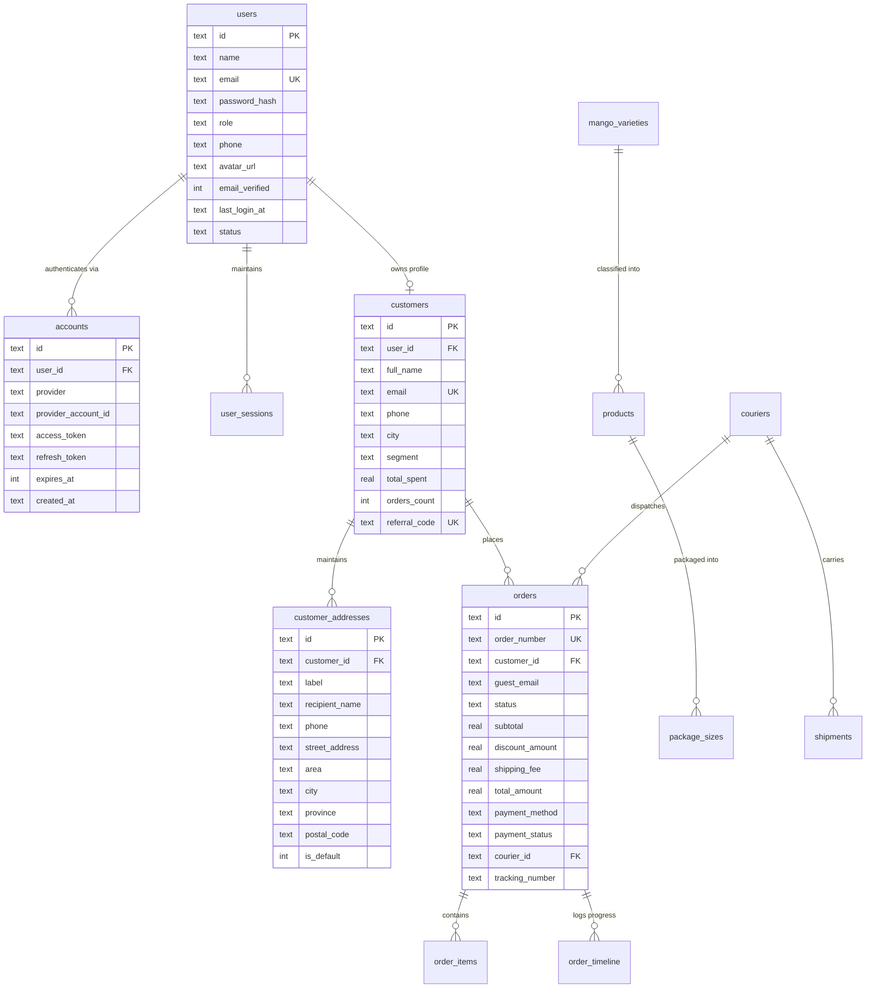
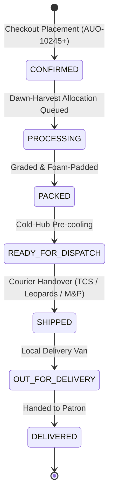

# Al Usmani Orchards — System Architecture & Data Engineering

**Brand:** Al Usmani Orchards (Estd. 1934 • Multan & Mirpur Khas)  
**Positioning:** *Fresh from Our Orchards • Premium Pakistani Mangoes • Naturally Grown • Delivered with Care*  
**Tagline:** *“From Our Orchards to Your Door.”*  

---

## 1. High-Level System Architecture

Al Usmani Orchards is architected as an enterprise-grade direct-to-consumer (D2C) e-commerce and orchard ERP operations engine built on modern full-stack web standards:

* **Framework:** Next.js 16.3.4 with Turbopack compilation.
* **Execution Boundary:** Edge Runtime for route interception and security headers (`src/middleware.ts`), Node.js Serverless runtime for authoritative API transactions.
* **Database Layer:** SQLite with Write-Ahead Logging (`WAL`) enabled for high-concurrency read/write transactions (`node:sqlite`).
* **Session Engine:** Cryptographically signed HMAC-SHA256 session tokens with dual-layer verification (Edge signature validation + server-side revocation tracking).
* **Identity Architecture:** OpenID Connect (OIDC) with multi-provider `accounts` linking and single-owner administrative authorization.
* **Email Pipeline:** Non-blocking asynchronous transactional email dispatch with audit logging.

```mermaid
graph TD
    Client[Web Browser / Mobile Client] --> Edge[Next.js Edge Middleware]
    Edge -->|Valid Admin HMAC| AdminApp[/admin ERP Command Center]
    Edge -->|Valid Patron HMAC| AccountApp[/account Patron Portal]
    Edge -->|Public Traffic| StoreApp[/ Public Storefront & Catalog]
    Edge -->|Invalid / Unauthorized| LoginRedirect[/login?redirect=...]

    AdminApp --> APILayer[Authoritative API Handlers]
    AccountApp --> APILayer
    StoreApp --> APILayer

    APILayer --> DB[(SQLite Database Engine - WAL Mode)]
    APILayer --> EmailService[Resilient Email Dispatcher]
    APILayer --> GoogleOIDC[Google OAuth 2.0 / OIDC API]
    EmailService --> NotificationLogs[(notification_logs)]
```

---

## 2. Entity-Relationship Schema

The database schema models the agricultural harvest lifecycle, customer identity, multi-provider accounts, and logistics tracking:



---

## 3. Order Lifecycle & State Machine

Every order placed via `/checkout` is authoritatively computed and validated on the server. Pricing, discount promotions, and delivery tariffs cannot be manipulated on the client.



### State Definitions & Trigger Events
1. **`CONFIRMED`**: Initial status generated immediately upon order submission. Eliminates administrative bottlenecks while guaranteeing sequence numbering (`AUO-XXXXX`). Triggers asynchronous order confirmation email.
2. **`PROCESSING`**: Assigned orchard crew schedules harvest for optimum fruit Brix sweetness.
3. **`PACKED`**: Mangos are hydro-cooled, individually foam-sleeved, and nested into corrugated gift boxes.
4. **`READY_FOR_DISPATCH`**: Boxes staged at climate-controlled hub.
5. **`SHIPPED`**: Consignment handed over to courier partner. Courier assigned (`TCS`, `Leopards`, `M&P`, `Pakistan Post`), tracking number issued, and automated dispatch email sent to customer.
6. **`OUT_FOR_DELIVERY`**: Courier vehicle is en route to recipient.
7. **`DELIVERED`**: Order received. Cash-on-delivery (COD) reconciled into accounts receivable.

---

## 4. Cold-Chain Courier Integration

Four major Pakistani logistics networks are integrated with custom vector emblems and standardized tracking URLs:

| Courier Partner | Code | Logo Asset | Tracking URL Template |
|---|---|---|---|
| **TCS Express** | `tcs` | `/images/couriers/tcs.svg` | `https://www.tcsexpress.com/tracking?consignmentNo={tracking}` |
| **Leopards Courier** | `leopards` | `/images/couriers/leopards.svg` | `https://www.leopardscourier.com/leopards-tracking?track={tracking}` |
| **M&P Express Logistics** | `mp` | `/images/couriers/mp.svg` | `https://mulphilog.com/tracking?cn={tracking}` |
| **Pakistan Post UMS** | `pakpost` | `/images/couriers/pakpost.svg` | `https://ep.gov.pk/tracking?track={tracking}` |

The public tracking page (`/track-order`) sanitizes sensitive recipient PII (phone number and complete residential address remain private) while presenting real-time milestone progress, courier details, and direct carrier portal navigation.

---

## 5. Resilient Transactional Notifications

Customer checkout operations are isolated from third-party email latency or SMTP downtime:
- All emails are dispatched asynchronously after database transaction commit.
- In environments where SMTP credentials are not yet configured, the system logs a `SIMULATED` record to `notification_logs`.
- If an SMTP connection times out or fails, the failure is logged and the customer checkout completes successfully without interruption.
