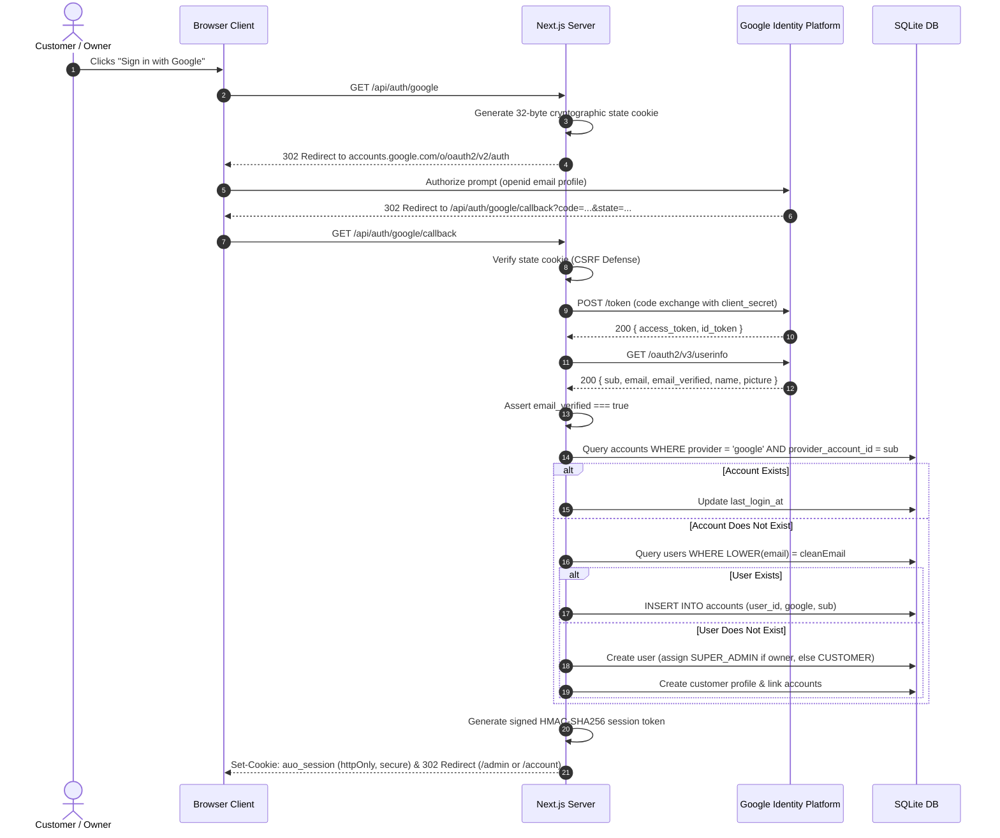

# Al Usmani Orchards — Authentication & Identity Architecture

**Brand:** Al Usmani Orchards  
**Scope:** OAuth 2.0 / OpenID Connect, Account Linking, Session Cryptography, and RBAC.

---

## 1. Overview of Identity Model

Al Usmani Orchards implements a hybrid authentication model:
1. **Google OpenID Connect (OIDC)**: One-click sign-in with verified email guarantees and profile synchronization.
2. **Password Authentication**: Scrypt-hashed credentials with secure password reset tokens.
3. **Multi-Provider Account Linking**: Decoupled `accounts` schema allowing users to authenticate via Google while maintaining a single persistent customer profile.

---

## 2. Google OAuth 2.0 / OpenID Connect Specification

The Google integration follows the official OAuth 2.0 Authorization Code Flow with OpenID Connect (OIDC):



### Strict Configuration Invariants
- **No Mock User Injection**: If `GOOGLE_CLIENT_ID` or `GOOGLE_CLIENT_SECRET` are omitted from environment variables, the system redirects to `/login` with an explicit configuration error. No mock or dummy patron data is ever fabricated.
- **Claim Verification**: `email_verified` must be `true` from Google UserInfo. Accounts with unverified emails are rejected to prevent identity spoofing.

---

## 3. Account Linking Schema (`accounts`)

```sql
CREATE TABLE IF NOT EXISTS accounts (
  id TEXT PRIMARY KEY,
  user_id TEXT NOT NULL REFERENCES users(id) ON DELETE CASCADE,
  provider TEXT NOT NULL,
  provider_account_id TEXT NOT NULL,
  access_token TEXT,
  refresh_token TEXT,
  expires_at INTEGER,
  token_type TEXT,
  scope TEXT,
  id_token TEXT,
  created_at TEXT NOT NULL DEFAULT (datetime('now')),
  UNIQUE(provider, provider_account_id)
);
```

Account linking rules:
1. If a user already created an account via password registration with `patron@example.com`, and subsequently signs in with Google using that verified email, the Google identity is linked to the existing user ID.
2. The user profile updates `avatar_url` from Google and marks `email_verified = 1`.
3. The customer retains all previous orders, addresses, and privilege codes.

---

## 4. Cryptographic Password Hashing

Passwords stored in `users.password_hash` utilize Node.js native `scrypt`:
- **Salt**: 16 cryptographically random bytes (`crypto.randomBytes(16)`).
- **Key Length**: 64 bytes (`derivedKey`).
- **Storage Format**: `scrypt:<salt_hex>:<derived_key_hex>`.
- **Verification**: Evaluated using constant-time equality (`crypto.timingSafeEqual`) to prevent timing attacks.

---

## 5. Dual-Layer Session Architecture

Sessions utilize cryptographically signed tokens combining Edge-level stateless verification with server-side revocability:

### Token Wire Format
```
[randomToken].[base64UrlPayload].[signatureHex]
```
1. `randomToken`: 32-byte high-entropy token generated via `crypto.randomBytes(32)`. SHA-256 hashed into `token_hash` in the `user_sessions` database table.
2. `base64UrlPayload`: JSON payload containing `{ userId, role, exp }`.
3. `signatureHex`: HMAC-SHA256 of `${randomToken}.${base64UrlPayload}` computed using `SESSION_SECRET` with Web Cryptography API (`crypto.subtle`).

### Cookie Attributes
- **Name**: `auo_session`
- **HttpOnly**: `true` (Cannot be read by JavaScript; immune to XSS token theft)
- **Secure**: `true` in production (Transmitted strictly over HTTPS)
- **SameSite**: `Lax` (Protects against CSRF attacks during cross-site navigations)
- **Path**: `/`
- **Max-Age**: 604,800 seconds (7 days)

### Verification Stages
- **Stage 1 (Edge Middleware - <1ms)**: `src/middleware.ts` extracts the cookie, validates the HMAC-SHA256 signature using Web Crypto, checks `exp`, and verifies that `role === 'SUPER_ADMIN'` before any admin page is loaded.
- **Stage 2 (Server Action / API)**: `getCurrentUser()` validates the signature and queries the `user_sessions` table in SQLite. If an admin terminates a session or a user signs out, the session is invalidated instantly.
